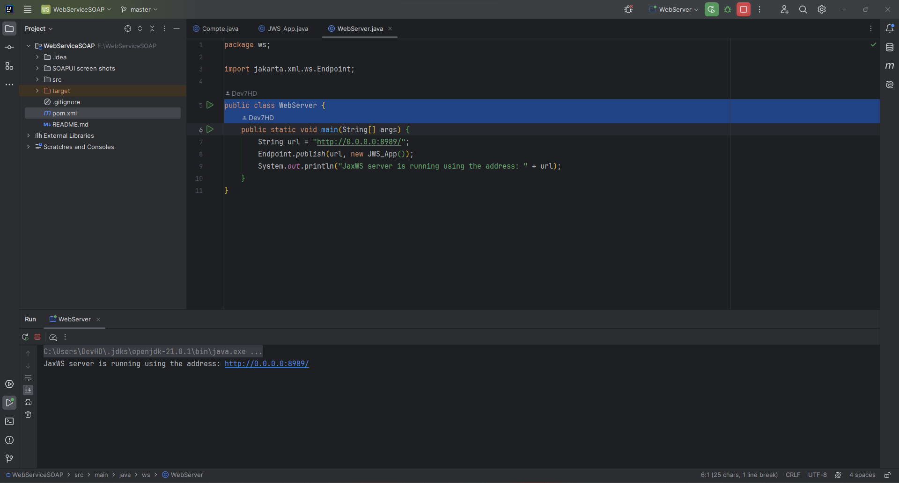
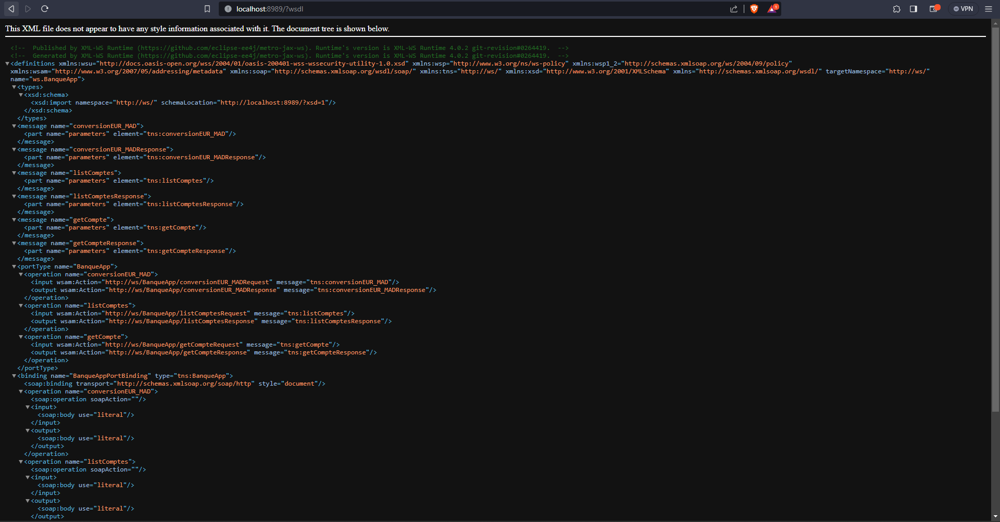
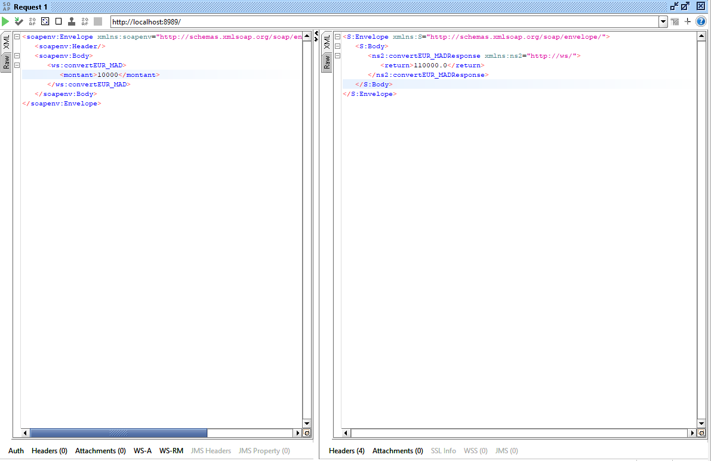
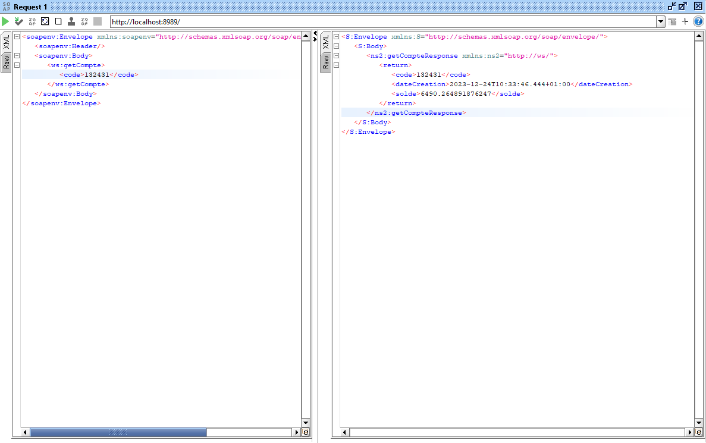
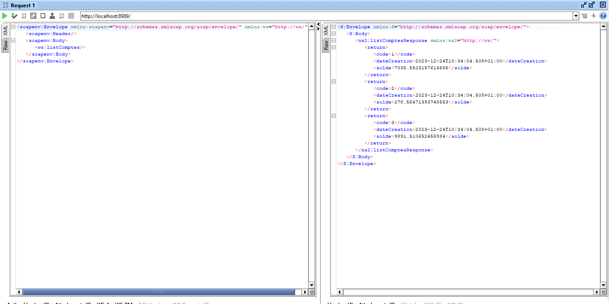

# Projet de Service Web Java (JAX-WS)

## Introduction

- SOAP (Simple Object Access Protocol) est un protocole de communication basé sur XML (eXtensible Markup Language) utilisé pour échanger des informations structurées dans le contexte des services web. Les services web sont des applications logicielles qui fournissent des fonctionnalités via Internet. SOAP définit une structure standard pour le format des messages échangés entre les applications, ce qui facilite l'intégration de systèmes hétérogènes.

- Un service web basé sur SOAP suit un modèle d'architecture appelé "web service basé sur SOAP". Dans ce modèle, les services exposent leurs fonctionnalités sous la forme de méthodes (ou opérations) accessibles via des protocoles basés sur SOAP. Ces méthodes sont décrites dans un format appelé WSDL (Web Services Description Language), qui spécifie comment les clients peuvent interagir avec le service.

   **SOAP :**
   Les messages échangés entre les clients et les services web sont encapsulés dans des enveloppes SOAP. Ces enveloppes définissent la structure des messages, y compris les en-têtes (headers) et les corps (bodies) des messages.

   **WSDL (Web Services Description Language) :**
   WSDL est un langage de description qui spécifie les détails du service web, y compris les opérations qu'il expose, les formats des messages attendus et produits, et les protocoles de communication à utiliser.

   **UDDI (Universal Description, Discovery, and Integration) :**
   UDDI est un registre de services web qui permet aux entreprises de publier et de découvrir des services web. Il fournit des mécanismes de découverte pour permettre aux clients de trouver des services web compatibles avec leurs besoins.

  `Les services web basés sur SOAP sont souvent utilisés dans des environnements d'entreprise où l'intégration de systèmes distribués est nécessaire. Cependant, avec l'évolution des technologies, d'autres approches comme les services web RESTful (basés sur l'architecture REST) gagnent également en popularité.`

## Présentation

Ce projet Java illustre la mise en œuvre d'un service web en utilisant l'API Java pour les services web XML (JAX-WS). Il met en avant les classes suivantes :

1. **Compte**

   - Représente un compte de base avec des attributs tels que le code, le solde et la date de création.

2. **JWS_App**

   - Une classe de service web annotée avec `@WebService` qui propose des méthodes pour la conversion de devises et la récupération d'informations sur les comptes.
   - Comprend des méthodes telles que `convertEUR_MAD` pour la conversion de l'Euro en Dirham marocain, `getCompte` pour récupérer un compte en fonction de son code, et`listComptes` pour obtenir une liste de comptes d'exemple.

3. **WebServer**
   - La classe principale qui publie `JWS_App` en tant que service web à une adresse spécifiée.

## Captures d'écran

## Structure du Projet

Le projet est organisé avec les packages suivants :

- **ws :** Contient les classes principales du projet.
