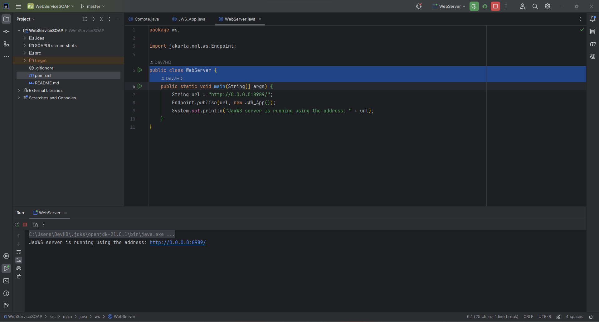
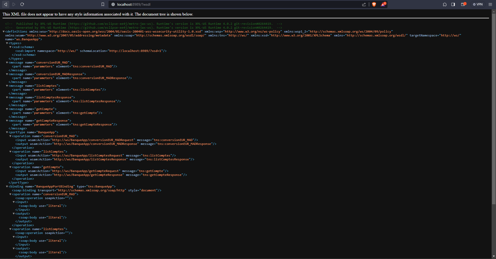
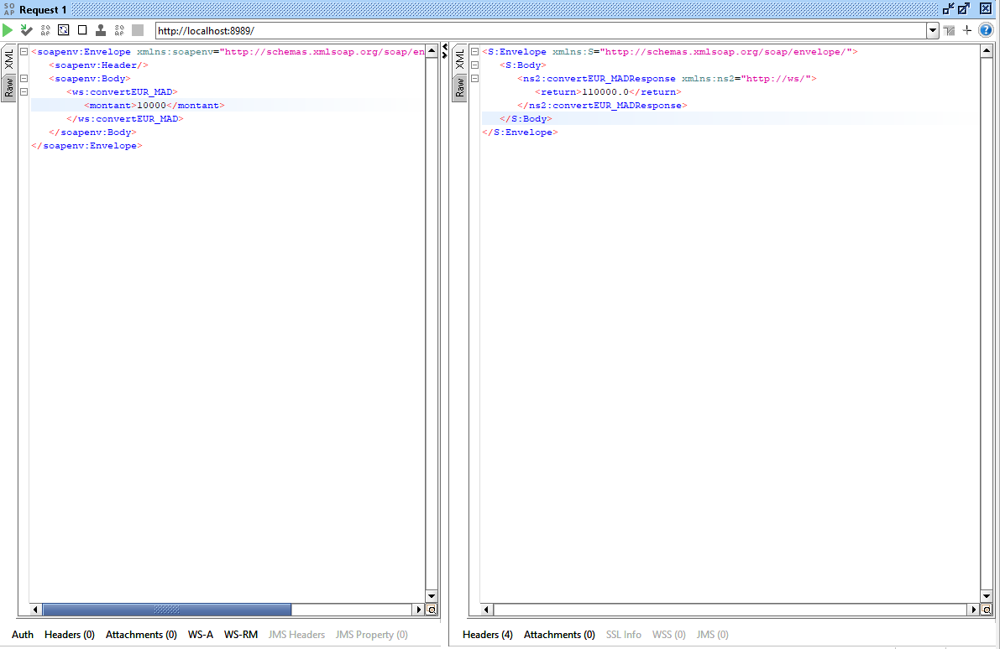
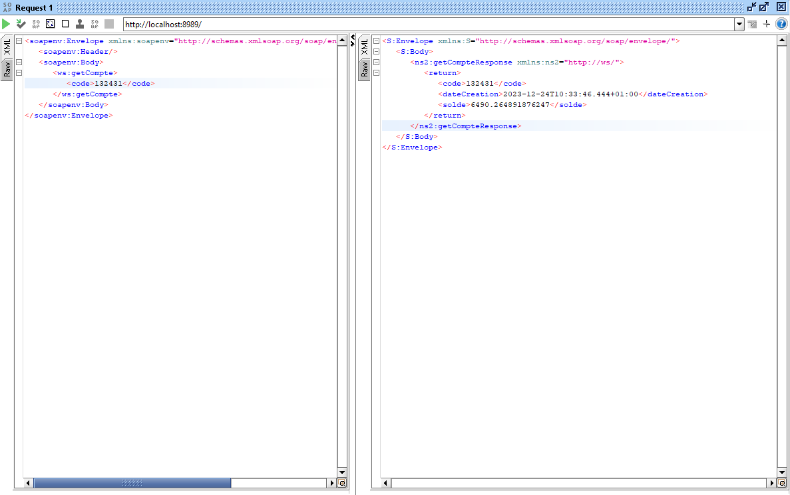
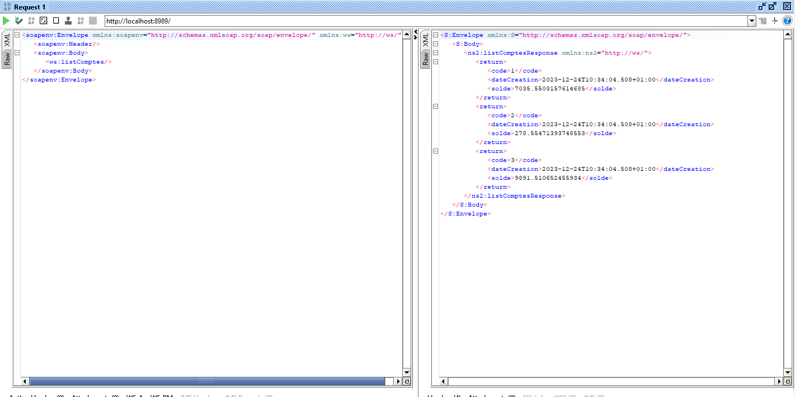

# Projet de Service Web Java (JAX-WS)

## Présentation

Ce projet Java illustre la mise en œuvre d'un service web en utilisant l'API Java pour les services web XML (JAX-WS). Il met en avant les classes suivantes :

1. **Compte**

   - Représente un compte de base avec des attributs tels que le code, le solde et la date de création.

2. **JWS_App**

   - Une classe de service web annotée avec `@WebService` qui propose des méthodes pour la conversion de devises et la récupération d'informations sur les comptes.
   - Comprend des méthodes telles que `convertEUR_MAD` pour la conversion de l'Euro en Dirham marocain, `getCompte` pour récupérer un compte en fonction de son code, et`listComptes` pour obtenir une liste de comptes d'exemple.

3. **WebServer**
   - La classe principale qui publie `JWS_App` en tant que service web à une adresse spécifiée.

## Captures d'écran

## Structure du Projet

Le projet est organisé avec les packages suivants :

- **ws :** Contient les classes principales du projet.
